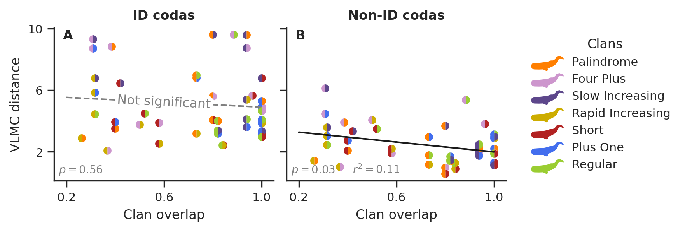

<h3>Social learning across symbolic cultural barriers in non-human cultures</h3>
António Leitão • Maxime Lucas • Simone Poetto • Taylor A. Hersh • Shane Gero •  David Gruber • Michael Bronstein • Giovanni Petri 

<h2 align="center">
</h2>

  

This repository contains the code used in the paper: _Social learning across symbolic cultural barriers in non-human cultures_.

Check out the paper on [ArXiv](https://arxiv.org/abs/2307.05304). The research was developed as part of the [CETI project](https://www.projectceti.org/).

### Relevant Links
 - **[Project CETI](https://www.projectceti.org/)**: international initiative to study and translate sperm whale communication
 - **[NPL Research](https://nplresearch.github.io/)**: Complex Systems Research Lab led by [Giovanni Petri](https://lordgrilo.github.io/)
 - **[Variable Length Markov Chain](https://github.com/antonio-leitao/vlmc)**: Optimized implementation of Variable Length Markov Chains written in Rust with Python bindings.
