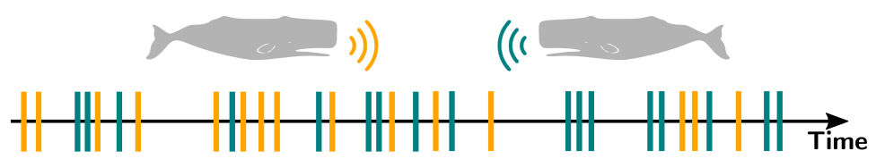
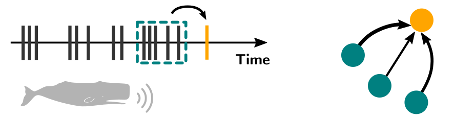
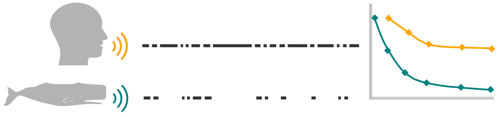

<h1 align="center">
  
  
  
The Non-Petri Lab Approach

</h1>

  <a href="https://docs.google.com/presentation/d/1QLaNecq34Ib3SUKU2tDVsz-5AsE-UsBhqjhc1-R9sos/edit?usp=sharing">Whalehouse</a> •
  <a href="https://www.dropbox.com/sh/6qqok1j6ma9jl2w/AABv0H6nryZOvHbFt0CVCySya?dl=0">Dropbox</a> •
  <a href="https://docs.google.com/document/d/13n4-3t70HZsvDpl_a2F-aijfi6leenky4wJN7Z8dJkM/edit">Monthly Agenda</a> •
  <a href="https://github.com/Antonio-Leitao/CETI/tree/main/Literature">Literature</a> •
  <a href="https://docs.google.com/document/d/13n4-3t70HZsvDpl_a2F-aijfi6leenky4wJN7Z8dJkM/edit">Code & Data</a> •
  <a href="#FAQ">FAQ</a>

## Contents
- [ ] Individual Whale Identification
- [ ] Variable Length Markov Model  
  - [ ] Shuffled and standard tree comparison.
- [x] Markov Chain Modeling
- [x] Coda Information Rate

## Tasks

> Expand for details

  

    <strong>Individual Whale Identification</strong>
  

  

  

  

    <strong>Varible Length Markov Chain</strong>
  

  

  
  

  

    <strong>Markov Chain Modeling</strong>
  

  

  
  

  

    <strong>Coda Information Rate</strong>
  

  

  
  

